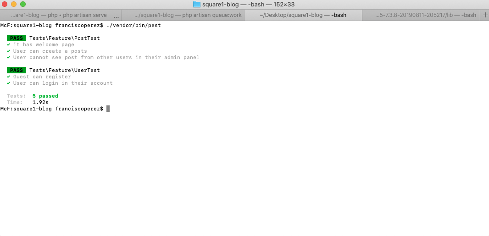
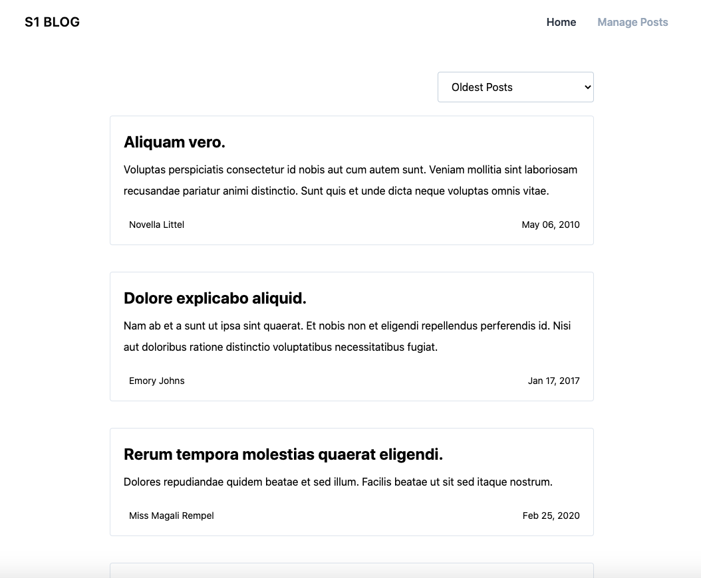
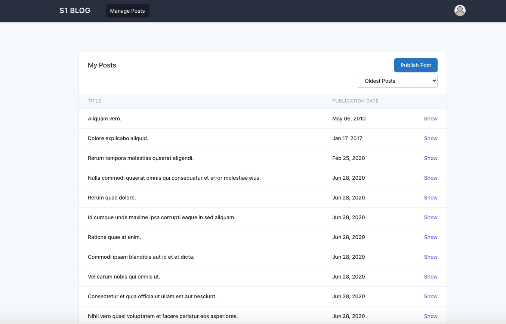

## How to install

Clone the project

```
git clone https://github.com/bran921007/Square1-Blog.git
```

Install Dependencies

```
composer install
```

Copy the .env.example into .env

```
cp .env.example .env
```

Create the database 'square1-blog' (w/o quotes)


Run migrations

```
php artisan migrate
```

Run seeders in order to get the Admin user

```
php artisan db:seed
```

Admin credentials

```
email:    admin@admin.com
password: 123456
```

Run the project

```
php artisan serve
```

## Configuration

The Auto Import will need two additional steps: 

1. Open the Queue Job server
```
php artisan queue:work
```

2. Run a cronjob hourly
```
php artisan schedule:run
```
##  Testing

Pest is a new Laravel framework for testing, a friendly one, based on PHPUnit.

In order to run this test:

```
./vendor/bin/pest
```


## Blog platform

Homepage



Admin Panel



